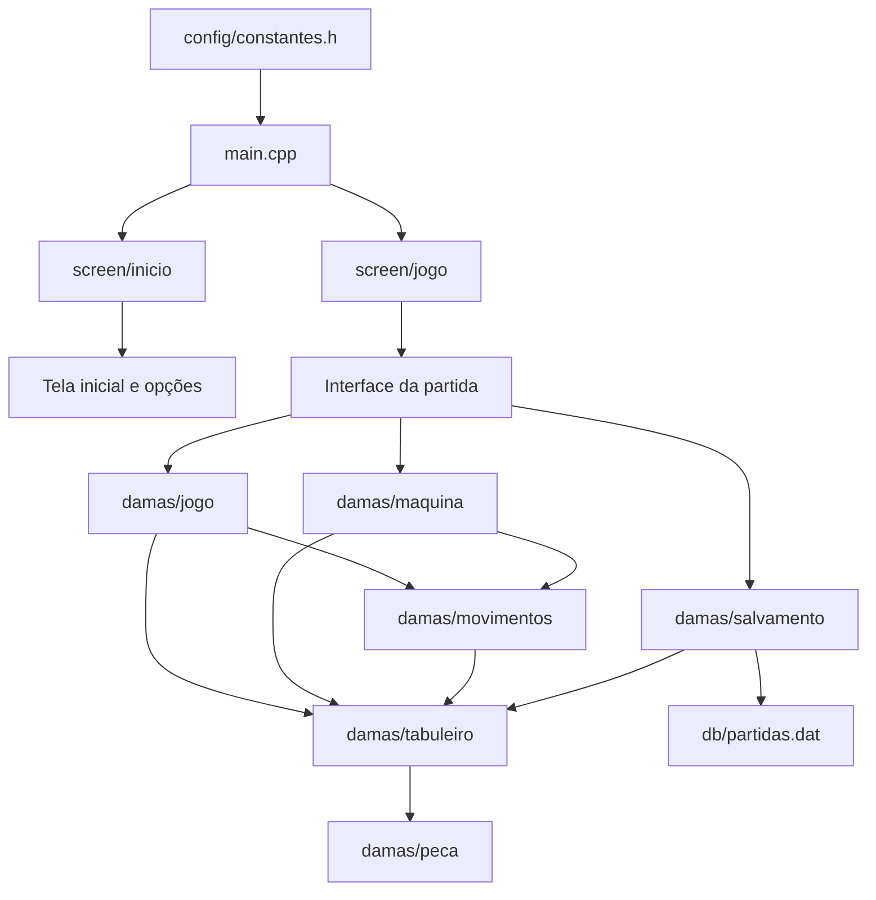
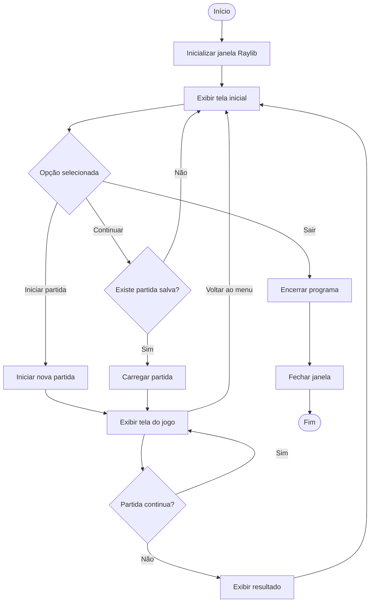
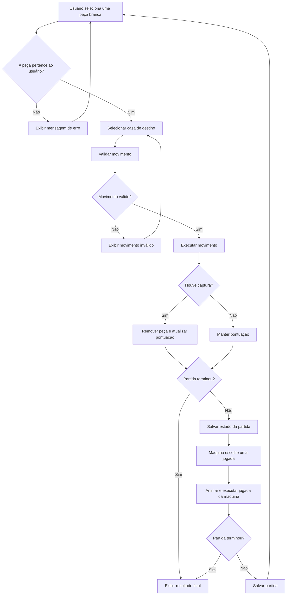

# 🎮 Damas

Jogo de damas desenvolvido em **C++**, utilizando a biblioteca **Raylib** para a interface gráfica. O jogo permite que o usuário jogue contra uma máquina, com validação de movimentos, captura de peças, promoção para dama, pontuação e salvamento de partidas.

## 📑 Sumário

* [1. Arquitetura do projeto](#1-arquitetura-do-projeto)
* [2. Fluxo das telas](#2-fluxo-das-telas)
* [3. Organização dos arquivos](#3-organização-dos-arquivos)
* [4. Descrição do jogo](#4-descrição-do-jogo)
* [5. Regras implementadas](#5-regras-implementadas)
* [6. Validações dos movimentos](#6-validações-dos-movimentos)
* [7. Funcionamento da máquina](#7-funcionamento-da-máquina)
* [8. Pontuação e fim da partida](#8-pontuação-e-fim-da-partida)
* [9. Salvamento e continuação](#9-salvamento-e-continuação)
* [10. Tecnologias utilizadas](#10-tecnologias-utilizadas)

---

## 💻 Tecnologias

<p align="left">
  
  
</p>

## 1. Arquitetura do projeto

O projeto foi organizado em módulos, separando a interface gráfica, as regras do jogo, o controle do tabuleiro, a lógica da máquina e o salvamento da partida.

Essa organização facilita a manutenção do código e permite que cada parte tenha uma responsabilidade específica.

### 1.1. Diagrama da arquitetura



**Responsabilidades dos módulos:**

* **`main.cpp`:** inicializa a janela, configura a taxa de quadros e controla o fluxo principal do programa.
* **`screen/inicio`:** apresenta o menu inicial e recebe a escolha do usuário.
* **`screen/jogo`:** desenha o tabuleiro, as peças, os botões, as mensagens e a animação da máquina.
* **`damas/jogo`:** controla o estado da partida, executa jogadas válidas, atualiza a pontuação e verifica a vitória por pontuação.
* **`damas/movimentos`:** contém as regras e validações de movimentos simples e capturas.
* **`damas/tabuleiro`:** inicializa e mantém a matriz que representa o tabuleiro.
* **`damas/peca`:** define as operações relacionadas às peças e à promoção para dama.
* **`damas/maquina`:** procura movimentos válidos para as peças pretas e escolhe um deles aleatoriamente.
* **`damas/salvamento`:** grava e recupera o estado da partida em um arquivo binário.
* **`config/constantes.h`:** reúne constantes utilizadas na configuração do programa, como dimensões da janela, título e FPS.

## 2. Fluxo das telas

Ao iniciar o programa, a janela é aberta e o menu inicial é apresentado. O usuário pode iniciar uma nova partida, continuar uma partida salva ou sair do jogo.

### 2.1. Fluxo principal



O botão **Continuar** fica visualmente desabilitado quando não existe um arquivo de partida salva. Ao selecionar uma nova partida, o estado anterior é descartado e o tabuleiro é inicializado novamente.

### 2.2. Fluxo de uma jogada



## 3. Organização dos arquivos

A estrutura lógica do projeto é organizada da seguinte forma. Os nomes abaixo representam os módulos utilizados no código; a localização exata pode variar conforme a estrutura do repositório.

```text
projeto-damas/
├── main.cpp
├── config/
│   └── constantes.h
├── screen/
│   ├── inicio.h
│   ├── inicio.cpp
│   ├── jogo.h
│   └── jogo.cpp
├── damas/
│   ├── jogo.h
│   ├── jogo.cpp
│   ├── tabuleiro.h
│   ├── tabuleiro.cpp
│   ├── peca.h
│   ├── peca.cpp
│   ├── movimentos.h
│   ├── movimentos.cpp
│   ├── maquina.h
│   ├── maquina.cpp
│   ├── salvamento.h
│   └── salvamento.cpp
└── db/
    └── partidas.dat
```

### Separação entre interface e regras

A pasta `screen` contém o código responsável pela interação com o usuário e pela apresentação visual. Já a pasta `damas` concentra as estruturas e operações relacionadas ao funcionamento do jogo.

Por exemplo, quando o usuário clica em uma casa do tabuleiro, a interface identifica as coordenadas e chama `realizarJogada()`. Essa função utiliza `validarJogada()` para verificar se o movimento respeita as regras antes de alterar o tabuleiro.

Dessa forma, a interface não precisa implementar novamente todas as regras do jogo.

---

## 4. Descrição do jogo

O jogo consiste em uma partida de damas entre uma pessoa e uma máquina.

* O tabuleiro possui **8 linhas e 8 colunas**, totalizando 64 casas.
* O jogador controla as peças brancas.
* A máquina controla as peças pretas.
* As peças são movimentadas na diagonal.
* É possível capturar peças adversárias.
* Quando uma peça normal alcança a última linha do lado adversário, ela é promovida a dama.
* Cada captura aumenta a pontuação do jogador responsável.
* A partida possui um limite de pontuação para definir a vitória.

A interface permite selecionar uma peça, escolher o destino e visualizar mensagens sobre o estado da partida. As jogadas da máquina também possuem uma animação para tornar a interação mais clara.

## 5. Regras implementadas

### 5.1. Tabuleiro e peças

O tabuleiro é representado por uma matriz de peças. Cada peça possui informações sobre:

* Linha e coluna em que está localizada.
* Cor: branca ou preta.
* Tipo: normal ou dama.
* Estado de ocupação da casa.

No início da partida, as peças são posicionadas nas três primeiras linhas e nas três últimas linhas, somente nas casas escuras.

### 5.2. Movimento das peças normais

As peças normais podem avançar **uma casa na diagonal**, desde que a casa de destino esteja vazia.

Na implementação atual:

* As peças brancas avançam para linhas de índice maior.
* As peças pretas avançam para linhas de índice menor.
* O movimento simples para trás não é permitido.

### 5.3. Captura de peças

Uma captura acontece quando uma peça se desloca na diagonal e remove uma peça adversária que esteja no caminho.

Para as peças normais, a captura deve ocorrer pulando exatamente duas casas na diagonal, com uma peça adversária na casa intermediária e a casa de destino vazia.

A implementação permite que peças normais capturem tanto para frente quanto para trás.

Para as damas, a captura pode acontecer em uma diagonal mais longa, desde que exista exatamente uma peça adversária no caminho, nenhuma peça própria bloqueie o movimento e a casa de destino esteja vazia.

Quando uma captura é executada, a peça adversária é removida do tabuleiro e a pontuação correspondente é incrementada.

### 5.4. Promoção para dama

Uma peça normal é promovida quando alcança a última linha do lado adversário:

* Brancas: linha `7`.
* Pretas: linha `0`.

Após a promoção, a peça passa a ser do tipo `DAMA` e pode se movimentar por várias casas na diagonal, desde que o caminho esteja livre.

### 5.5. Obrigatoriedade de captura

Antes de validar um movimento simples, o sistema verifica se o jogador possui alguma captura disponível no tabuleiro.

Se existir uma captura, o jogador precisa realizar uma captura. Um movimento simples será considerado inválido enquanto houver captura disponível para aquele jogador.

Essa verificação é realizada pela função `existeCapturaDisponivel()` e aplicada em `validarJogada()`.

---

## 6. Validações dos movimentos

A função `realizarJogada()` centraliza as verificações necessárias antes de executar uma jogada. Ela utiliza as funções de validação do módulo `movimentos`.

| Validação              | Comportamento                                                                                        |
| ---------------------- | ---------------------------------------------------------------------------------------------------- |
| Limites do tabuleiro   | Rejeita coordenadas fora das 8 linhas e 8 colunas.                                                   |
| Casa de origem         | Exige que exista uma peça na posição inicial.                                                        |
| Cor da peça            | Verifica se a peça pertence ao jogador da vez.                                                       |
| Casa de destino        | Exige que o destino esteja vazio.                                                                    |
| Movimento diagonal     | Rejeita deslocamentos que não seguem a diagonal.                                                     |
| Distância do movimento | Restringe o movimento simples a uma casa para peças normais e permite distâncias maiores para damas. |
| Direção                | Restringe o movimento simples das peças normais à direção de avanço correspondente à sua cor.        |
| Caminho da dama        | Impede que a dama passe por peças que bloqueiem o caminho.                                           |
| Captura de peça normal | Exige uma peça adversária na casa intermediária.                                                     |
| Captura da dama        | Exige exatamente uma peça adversária no caminho e impede passar por peças próprias.                  |
| Captura obrigatória    | Quando existe captura disponível, rejeita movimentos que não capturem.                               |

Se uma validação falhar, `realizarJogada()` retorna `false` e o movimento não é executado. A interface apresenta uma mensagem informando que a jogada é inválida.

### 6.1. Principais funções de validação

* **`validarJogada()`**: decide se o movimento deve ser validado como captura ou movimento simples, considerando a obrigatoriedade de captura.
* **`podeMoverSimples()`**: verifica os movimentos sem captura.
* **`podeCapturar()`**: verifica as condições para capturar uma peça.
* **`existeCapturaDisponivel()`**: percorre o tabuleiro para identificar capturas possíveis para determinada cor.
* **`realizarJogada()`**: verifica a jogada, executa o movimento e atualiza o estado da partida.
* **`moverPeca()`**: altera a posição da peça, remove a peça capturada quando aplicável e verifica a promoção para dama.

---

## 7. Funcionamento da máquina

A máquina joga com as peças pretas. Sua lógica está implementada no módulo `maquina`.

A função `escolherJogadaMaquina()` percorre o tabuleiro e identifica as peças pretas. Para cada peça, testa as posições de destino e utiliza `validarJogada()` para encontrar movimentos válidos.

Depois de reunir as jogadas possíveis, a máquina escolhe uma delas aleatoriamente.

O funcionamento pode ser resumido em três etapas:

1. Identificar as peças da máquina.
2. Encontrar os movimentos válidos para essas peças.
3. Selecionar uma jogada aleatória e executá-la após a animação.

A máquina não utiliza um algoritmo de inteligência artificial que antecipa jogadas ou calcula estratégias futuras. Sua escolha é aleatória entre os movimentos válidos encontrados.

Como a validação também considera a captura obrigatória, a máquina não deve escolher um movimento simples quando existe uma captura disponível.

Se a máquina não encontrar movimentos válidos após a jogada do usuário, a interface encerra a partida e apresenta a vitória das peças brancas.

---

## 8. Pontuação e fim da partida

A pontuação é controlada pela estrutura `Partida`, que mantém, entre outras informações, a quantidade de pontos das peças brancas e pretas, o turno atual e o estado da partida.

Cada captura válida aumenta em um ponto a pontuação do jogador que realizou a captura.

A função `partidaFinalizada()` verifica se alguma das pontuações atingiu o limite definido por `PONTOS_VITORIA`.

A função `vencedor()` identifica qual cor atingiu o limite de pontuação.

Quando a partida termina, o sistema apresenta uma janela com o resultado e o placar final. O arquivo de salvamento da partida é excluído para impedir que uma partida encerrada seja continuada como se ainda estivesse em andamento.

**Observação:** no código atual, o término por pontuação é tratado pelo módulo de regras. A ausência de movimentos da máquina também é tratada na interface. A verificação de ausência de movimentos para as peças brancas ainda não está centralizada na lógica de fim de partida.

---

## 9. Salvamento e continuação

O sistema permite salvar o estado atual da partida e continuar posteriormente.

Os dados são armazenados no arquivo binário `db/partidas.dat`, por meio das funções do módulo `salvamento`.

### 9.1. Dados armazenados

O arquivo contém:

* Turno atual.
* Pontuação das peças brancas.
* Pontuação das peças pretas.
* Estado de cada casa do tabuleiro, incluindo ocupação, cor e tipo da peça.

### 9.2. Quando a partida é salva

O salvamento é realizado após uma jogada válida do usuário, antes da resposta da máquina, e novamente após a jogada da máquina. Dessa maneira, o jogo registra de quem é a vez de jogar.

A partida também é salva quando o usuário pressiona `ESC`, seleciona **Voltar ao menu** ou fecha a janela enquanto a partida continua em andamento.

### 9.3. Como funciona a continuação

Quando o usuário escolhe **Continuar**, a função `carregarPartida()` recupera os dados do arquivo e restaura o tabuleiro, a pontuação e o turno.

Se o salvamento indicar que é a vez das peças pretas, a tela do jogo inicia automaticamente o processamento da jogada da máquina.

O código também verifica alguns dados carregados, como o valor do turno, a pontuação, o estado de ocupação das casas e o tipo das peças.

### 9.4. Observações sobre o arquivo

Para que o salvamento funcione, a pasta `db` precisa existir no diretório de execução do programa. O código atual grava o arquivo, mas não cria essa pasta automaticamente.

O arquivo utiliza formato binário e não é destinado à leitura manual. Como não há identificação de versão no formato atual, alterações na estrutura dos dados podem exigir a remoção de arquivos antigos de salvamento.

---

## 10. Tecnologias utilizadas

| Tecnologia               | Utilização                                                                     |
| ------------------------ | ------------------------------------------------------------------------------ |
| C++                      | Linguagem utilizada para desenvolver a lógica e a estrutura do jogo.           |
| Raylib                   | Criação da janela, desenhos, botões, detecção de cliques e animações.          |
| Biblioteca padrão do C++ | Manipulação de arquivos, geração de números aleatórios e operações auxiliares. |
| Mermaid                  | Criação dos diagramas de arquitetura e fluxo diretamente no README.            |
| Git e GitHub             | Controle de versão e disponibilização do código-fonte.                         |

---

## Considerações finais

O projeto aplica conceitos de programação em C++, modularização, estruturas de dados, matrizes, funções, validação de regras e manipulação de arquivos.

A separação entre interface gráfica e lógica do jogo facilita a compreensão do código e permite evoluir o projeto futuramente, por exemplo, com melhorias na estratégia da máquina, novas regras, testes automatizados e validações adicionais para o encerramento da partida.
